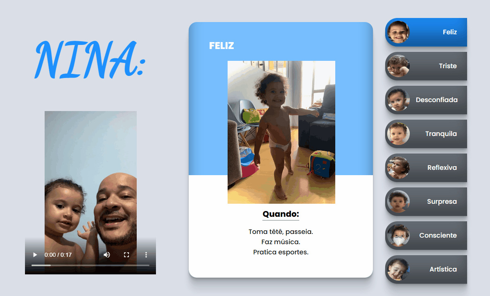

# Projeto Nina Emoções ✨💙

Projeto que mostra cards diferentes de acordo com o clique nos botões de emoções relacionados ao lado. Foi incluído também um vídeo sem reprodução automática.

Encontrei algumas dificuldades nesse projeto, mas a principal foi no responsivo. O vídeo inserido pelo YouTube, não abria em todos os dispositivos móveis, precisei usar o aplicativo Kapwing que resolveu o problema. No mais, apenas achar os parâmetros certos pro JS e achar as medidas certas para cada resolução.

## Tecnologias usadas

- HTML
- CSS
- JavaScript

Clique na imagem para acessar o projeto!
